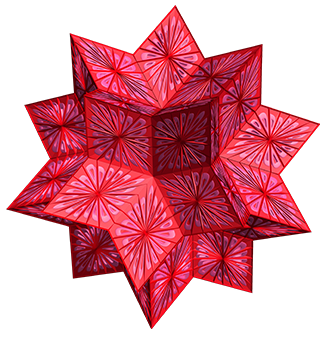

## Algorithm Visualization • Robotics •
Учусь, экспериментирую, пишу свой первый проект.

## Tech Stack

  
  
  
  

    Java &nbsp;&nbsp;
    Python &nbsp;&nbsp;
    MATLAB &nbsp;&nbsp;
    ROS 2 &nbsp;&nbsp;
    LaTeX &nbsp;&nbsp;
    Linux &nbsp;&nbsp;
    Git &nbsp;&nbsp;
    Wolfram Mathematica
  

